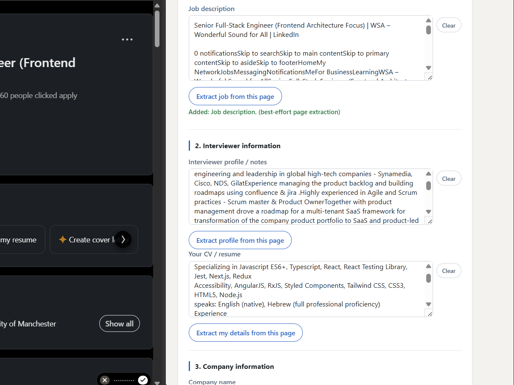
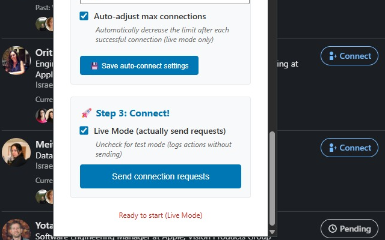

# LinkedIn Connection Automator

## [Install from the Chrome Web Store](https://chromewebstore.google.com/detail/linkedin-connection-assis/poedmlfffaldgihhpffkbknjegmkpclj)

---

This repository contains two Chrome extension builds from one codebase:

| | Developer build | Store build |
| --- | --- | --- |
| **Purpose** | Full automation for local/developer use | One-at-a-time invite assistant for Chrome Web Store |
| **Send behavior** | Clicks LinkedIn's Send button automatically (Live Mode) | Never clicks Send — you review and send each invite yourself |
| **Batch processing** | Yes — processes all profiles across pages | No — prepares one invite per button click |
| **Career Tools** | Optional AI interview prep & company research — requires your own Anthropic API key | Optional AI interview prep & company research — requires your own Anthropic API key |
| **Limits** | Pages and connection count limits | None needed (single-step flow) |
| **Install method** | Load unpacked via `chrome://extensions` | Load unpacked or install from Chrome Web Store |
| **Build command** | `npm run build` | `npm run build:store` |
| **Output** | `dist/` + root `manifest.json` | `release/store/` (self-contained) |

This project is not affiliated with or endorsed by LinkedIn.

## Screenshots

| Search setup | Connect & send |
| --- | --- |
|  |  |

## Developer Build

Full automation with Test Mode and Live Mode. Intended for local/developer use only. Users who run this build are responsible for how they use it, including compliance with LinkedIn's terms, Chrome extension policies, and applicable law.

### Developer: What It Does

- Builds LinkedIn people-search URLs from company, title, location, connection-degree, and page inputs.
- Reads filter values from the active LinkedIn search URL.
- Saves search and message settings in local Chrome extension storage.
- Finds visible LinkedIn profiles with Connect buttons across pages.
- Opens the LinkedIn invite dialog, adds a personalized note, and processes profiles sequentially.
- **Test Mode:** opens and cancels invite dialogs without sending requests.
- **Live Mode:** clicks LinkedIn's Send button and sends connection requests.
- Supports limits for pages and max connection requests with optional auto-decrement.
- Includes random delays between actions.

### Career Tools

Both builds provide two optional, consent-gated research tools on LinkedIn:

- On a personal profile (`/in/...`), **Interview Preparation** combines visible public professional content with your pasted CV and target job description. It creates non-diagnostic rapport, communication, leadership-matching, story-selection, and narrative guidance; it does not assess hostility, deception, or adversarial behavior.
- On a LinkedIn job page, **Company & Role Intelligence** creates a six-part company, architecture, role-expectations, interview, and compensation report. It performs public company research only with a valid LinkedIn company URL; otherwise it clearly generates a Stage-B-only, no-research report with modeled estimates.

Open the popup on the relevant page, enter your Anthropic API key and model ID, review the per-run consent checkbox, and select the action. Resume/CV, job description, and manual fallback fields are local-only trusted extension storage. Set a spend limit on the API key. Company research requires organization-level Anthropic web-search access; CV and full JD text never enter the web-search request, and Anthropic processes search results server-side. Career Tools require a Chrome version that supports trusted-context storage; they remain disabled with an update-Chrome message if it is unavailable.

Career Tools are entirely optional in both builds: off by default, disabled until you supply your own Anthropic API key, and never sent to Anthropic without per-run consent and a preview of exactly what will be sent. The core connection-request features in both builds work with no API key and no network calls beyond LinkedIn itself.

### Developer: Installation

1. Clone or download this repository.
2. Install dependencies:

   ```sh
   npm install
   ```

3. Build:

   ```sh
   npm run build
   ```

4. Open Chrome and go to `chrome://extensions/`.
5. Enable Developer Mode.
6. Click **Load unpacked** and select this project folder.

If the extension was already loaded, click reload on the extension card after rebuilding.

### Developer: Usage

1. Open the extension popup.
2. Fill in search filters or extract them from the current LinkedIn search URL.
3. Click **Save & search** to open a LinkedIn people search page.
4. Write the connection note and save settings.
5. Choose Test Mode or Live Mode.
6. Click **Send connection requests**.

Use Test Mode first. Live Mode sends real LinkedIn connection requests.

## Store Build

A separate, store-policy-compliant variant that prepares one invite draft at a time. The extension never clicks Send — it opens LinkedIn's invite dialog, fills the note you composed, and leaves the dialog open for you to review and send yourself.

### Store: What It Does

- Same search URL builder and message draft composer as the developer build.
- On each "Prepare next invite" click: finds the next connectable profile on the current page, opens its invite dialog, and fills the note.
- Tracks which profiles have been prepared in the current page session so repeated clicks advance through the list without revisiting the same profile.
- No batch processing, no Send click, no Live Mode.

### Store: Installation

```sh
npm install
npm run build:store
```

The store build is assembled into `release/store/`. Load it in Chrome via `chrome://extensions` → **Load unpacked** → select `release/store/`.

### Store: Usage

1. Open the extension popup.
2. Fill in search filters and click **Save & open search** to navigate to LinkedIn.
3. Compose your message draft and click **Save settings**.
4. Click **Prepare next invite** — the extension opens LinkedIn's invite dialog and fills your note.
5. Review the recipient and message in LinkedIn, then click Send (or close the dialog to skip).
6. Click **Prepare next invite** again for the next profile.

If the page script is not reachable (e.g. the LinkedIn tab was open before the extension was installed), reload the LinkedIn search page and try again.

## Development

```sh
npm install
npm run build        # developer build → dist/
npm run build:store  # store build → release/store/
npm run watch        # developer build in watch mode
npm run typecheck:watch
npm test
npm run verify:clean-checkout
npm run verify:store-baseline
```

`npm run build` uses esbuild for the developer extension and emits every manifest-referenced script. Run `npm run typecheck:watch` in a second terminal when live type errors are useful. `src/build-target.ts` is generated before each documented build, typecheck-watch, and test workflow and is intentionally not committed; use `npm test`, rather than bare Vitest, so its `pretest` bootstrap runs. `npm run verify:clean-checkout` copies exactly the files `git ls-files` reports (tracked plus untracked-but-not-ignored, so `src/build-target.ts` is naturally excluded since it's gitignored) into a temporary directory, then runs `npm ci && npm test` there without modifying your checkout — proving what a fresh `git clone` would build and test, not just what happens to be on disk locally. `npm run verify:store-baseline` checks that the packaged store build still matches the recorded baseline. Anthropic usage, including adaptive-thinking tokens, can affect provider cost.

## Files

| File | Purpose |
| --- | --- |
| `manifest.json` | Developer build manifest |
| `manifest.store.json` | Store build manifest (used by `build:store`) |
| `src/content.ts` | Developer build content script (automation) |
| `src/content.store.ts` | Store build content script (single-step, no Send) |
| `src/popup.ts` | Developer build popup logic |
| `src/popup.store.ts` | Store build popup logic |
| `src/background.ts` | Shared automation-completed relay, used by both builds |
| `src/background.dev.ts` | Developer build service worker entry point |
| `src/background.store.ts` | Store build service worker entry point |
| `src/careerBackground.ts` | Career Tools message/port wiring, shared by both background entry points |
| `popup.html` | Developer build popup UI |
| `popup.store.html` | Store build popup UI |
| `scripts/set-build-target.js` | Injects `BUILD_TARGET` constant before `tsc` |
| `scripts/package-store.js` | Assembles `release/store/` from store build output |
| `tsconfig.json` | Developer TypeScript config |
| `tsconfig.store.json` | Store TypeScript config (separate entry points) |
