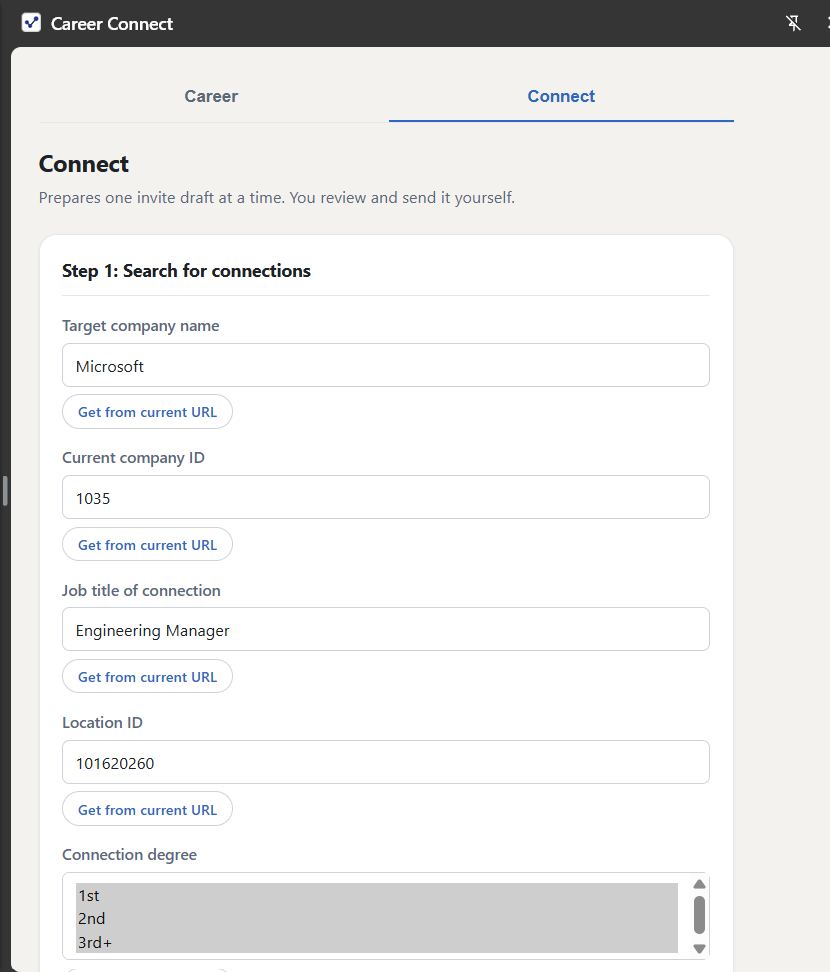
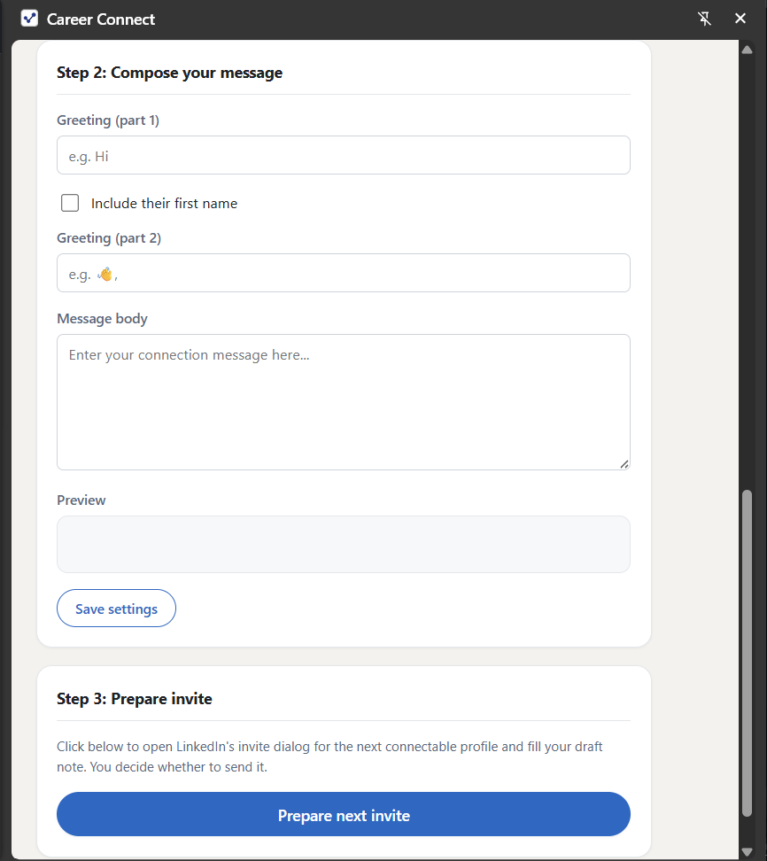

# Career Connect

## Turn LinkedIn research into better conversations

[Install the Chrome Web Store build](https://chromewebstore.google.com/detail/linkedin-connection-assis/poedmlfffaldgihhpffkbknjegmkpclj)

Career Connect is a Chrome extension for the part of networking that normally becomes a tedious collection of tabs, copy-and-paste, and half-finished notes.

It helps you:

- find relevant LinkedIn people with precise search criteria;
- prepare personalized connection invites at scale;
- research a company and role before an interview; and
- turn a public professional profile, your CV, and a job description into practical interview preparation.

The result is a focused workflow from **discover → understand → reach out**. It keeps the human in control of the final message and the final decision.






## One workflow for the work around networking

Networking usually means moving between search results, profiles, job descriptions, notes, and interview preparation. Career Connect brings those moments into the browser tab where the research is happening.

### A product with two deliberately different experiences

The same codebase produces two builds:

| | Developer build | Chrome Web Store build |
| --- | --- | --- |
| Best for | Personal workflows and local automation | Safe, review-first outreach |
| Connection requests | Can process many profiles across pages | Prepares one invite at a time |
| Send behavior | Test Mode or Live Mode | Never clicks LinkedIn's Send button |
| User control | Configurable limits and explicit mode selection | Review every recipient and message before sending |

The store build is not simply a restricted flag on the developer build. It is a separate packaged experience with its own manifest, content entry point, UI, and release verification while sharing the underlying feature logic.

### Career preparation with your own context

The popup opens on a **Career** tab (with **Connect** — the connection workflow — alongside it); the last tab you used is restored the next time you open the popup. Career Tools use a bring-your-own-key model: the user chooses Anthropic or OpenAI and pays the provider directly. The extension provides:

- one combined, adaptive interview-preparation report built from whatever context is available — CV, job description, interviewer profile, company details, role, seniority, location, and interview stage — rather than separate interview/company reports;
- a constrained, searchable model selector per provider (type to filter; only listed, verified model IDs can be selected — no free-text model IDs);
- a company-research stage when a valid LinkedIn company URL is available, and a synthesis stage that still produces a full report without it;
- best-effort extraction from the current page for job, interviewer/profile, and company context — including LinkedIn profiles (including your own), job postings, job-search result pages, company pages, and other LinkedIn/non-LinkedIn pages with useful information — that only ever adds to existing data, never overwrites it;
- streamed reports in a dedicated report view, including a collapsed "Generation context" section showing the exact input snapshot and provider/model used;
- report/case history: reopen a prior report; add its saved context to your current case or replace the current case with it; delete one you no longer need; or start a **New** case without losing earlier ones — History also shows total storage used and flags any unreadable saved record;
- a session-storage recovery anchor for the rare case a report can't be saved to local storage right away — it stays recoverable (with a **Retry save** action in History and on the report page) until the browser closes;
- source-aware output and explicit distinctions between researched facts, user-provided context, and modeled estimates;
- provider-specific request handling, error messages, and separate saved credentials per provider; and
- a transmission preview and an explicit transmission notice before any content leaves the browser — reviewed once per submission, with no separate recurring consent checkbox.

Career Tools are optional and the core connection workflow works without an API key.

### Two ways to use the connection workflow

The developer build supports a safe Test Mode before Live Mode. Test Mode opens and cancels invite dialogs so the workflow can be inspected without sending requests. Live Mode is bounded by page and connection limits and uses deliberate pacing between actions.

The store build takes the more conservative approach required for a public extension: it prepares one invite draft, fills the user's note, and leaves LinkedIn's dialog open. The user reviews, edits, sends, or skips it.

### Built around trust and continuity

- streamed provider responses are assembled incrementally and persisted while they arrive;
- reports can reconnect to a running background job after a page or worker interruption;
- provider changes never silently change the provider used by an existing report;
- profile and job extraction has readiness checks and fallback behavior for rendered or incomplete pages;
- report output is validated before it is presented, including structured estimate sections and citation handling;
- user and extracted content is rendered as text rather than injected as HTML; and
- sensitive Career data is kept in trusted extension storage and is only sent through an explicit user action.

A missed selector produces a useful explanation, a dropped connection does not lose a report, and a powerful action has an inspectable path before it becomes irreversible.

## See it in action

### Connection workflow

1. Enter company, title, location, connection-degree, and page filters—or extract filters from a LinkedIn search URL.
2. Preview and save a personalized message.
3. Run in Test Mode to inspect the flow, or choose Live Mode in the developer build.
4. Let Career Connect move through visible, connectable profiles sequentially.

### Career workflow

1. Open the **Career** tab and choose Anthropic or OpenAI, entering your own key and picking a model from the searchable list for that provider.
2. Work through the four sections in any order — they're a visual guide, not a gated wizard: job description & role details, interviewer information, company information, then generate. Use each section's Extract button on the current page, or type/paste manually.
3. Pick an interview stage if you have one, and review the transmission notice and preview.
4. Generate the combined report, follow the streamed result, and reopen it later from History alongside its saved input snapshot.
5. Use **New** to start a fresh case (for a different company or role) without losing earlier reports.

Company research is organization-level research performed by the selected provider when a valid LinkedIn company URL is available. The extension keeps the CV and full job description out of that web-search request, then uses the returned findings for the final report; without a company URL, the report still generates using whatever other context is supplied.

## Run locally

```sh
npm install
npm run build
```

Then open `chrome://extensions/`, enable Developer Mode, choose **Load unpacked**, and select the repository directory. The developer build is emitted to `dist/`.

To build the review-first Web Store variant:

```sh
npm run build:store
```

Load `release/store/` as an unpacked extension, or install it from the Web Store using the link above.

## Verification

Automated coverage exercises the parts of the extension where a small mistake has an outsized effect: provider request contracts, streaming assembly, error classification, trusted-storage capability checks, profile and job extraction, safe report rendering, report reconnection, provider isolation, report validation, and store-build baselines.

Useful commands:

```sh
npm test
npm run verify:clean-checkout
npm run verify:store-baseline
```

`verify:clean-checkout` reconstructs a fresh checkout from repository-visible files and runs the install-and-test path there. That protects against a project appearing healthy only because of generated or ignored files on one developer's machine. The store-baseline check protects the packaged review-first build from accidental behavioral drift — run `npm run build:store && npm run generate:store-baseline` to refresh `test/fixtures/store-baseline.json` after any change to packaged output (manifest, popup HTML, or bundled scripts).

## Architecture at a glance

The implementation keeps the two products aligned without forcing them to behave identically:

- `src/popup-tabs.ts` — the shared Career/Connect tab shell used by both popups;
- `src/popup-career-shared.ts` — shared Career Tools state, extraction actions, provider/model controls, previews, and history;
- `src/popup-search-shared.ts` — shared search and connection workflow behavior;
- `src/career/fields.ts` — the canonical Career input contract (form ↔ wire mapping, caps, provenance);
- `src/career/merge.ts` and `src/career/patch.ts` — additive extraction merge and extraction-to-field mapping;
- `src/models.ts` — the constrained, verified per-provider model catalog;
- `src/aiClient.ts` — durable Career jobs, streaming lifecycle, persistence, and background orchestration;
- `src/aiClient/provider.ts` — Anthropic/OpenAI request construction and provider error handling;
- `src/extract/profile.ts`, `src/extract/job.ts`, `src/extract/company.ts`, `src/extract/generic.ts` — page extraction with resilient fallback ladders (selectors → JSON-LD → Open Graph metadata → visible text), and `src/extract/messageHandler.ts`, the shared extraction listener used by every content-script entry point;
- `src/prompts/careerReport.ts` and `src/validate/report.ts` — the combined-report prompt and its validator;
- `src/report.ts` and `src/render/markdown.ts` — report presentation, copying, sources, generation-context snapshot, and regeneration;
- `src/content.ts` / `src/content.store.ts` — developer automation versus single-invite content behavior; and
- `scripts/build-*.js` and `scripts/package-*.js` — reproducible build and packaging paths.

The code is TypeScript, compiled into Manifest V3 Chrome extension assets, with shared modules used by both builds and Vitest coverage for the most failure-prone contracts.

## Product direction

Both builds now share a two-tab popup (Career first and default, Connect second), one adaptive combined Career report, a constrained searchable model selector, additive best-effort extraction from any current page, and durable report history with input snapshots.

The dev build's declared content script already covers every page (`<all_urls>`), so its extraction controls work anywhere with no extra permission prompts. The Chrome Web Store build ships two pipeline variants from the same commit (see `STORE_SUBMISSION.md`): the default **B1** variant, whose declared content script is limited to `https://www.linkedin.com/*` and which never calls `chrome.scripting` or requests any additional permission (extraction outside LinkedIn is reported as unavailable in this build); and a gated **B2** variant (`npm run build:store:b2` / `npm run package:b2`), not shipped until a publisher approves it and it passes live validation, which adds on-demand injection of a read-only extraction bundle plus a section-local "Allow page access" control that requests Chrome's optional `<all_urls>` permission only when clicked. `src/extract/capabilities.ts` derives which behavior applies at runtime from the installed manifest and API availability — never from a build-time flag — so the same popup code runs correctly against either package.

Every job write is bounded and anchored before any provider call starts or resumes (plan §8.4-§8.8): `src/career/bytes.ts` splits a persisted job into an immutable fixed/identity part and a bounded growth part and clamps the growth part to per-field byte ceilings; `src/career/persistedJob.ts` is the single ingress every local-storage read, session-storage read, and tab-submitted record passes through, repairing or refusing malformed data rather than trusting a stored schema version; and `src/career/pendingJobs.ts` reserves a `chrome.storage.session` recovery anchor — capacity-checked against the exact serialized register, never evicting another job's anchor — whenever `chrome.storage.local` fails, so a job is never started or resumed without *some* durable place for its progress to live. `retainJobsForStorage` never deletes a whole report automatically — it only compacts resume-only state (research transcripts, reasoning warnings) from complete/cancelled jobs under a generous (50 MB) byte safety net. Request-size budgeting against verified model limits is implemented in `src/aiClient/modelBudget.ts` and enforced at the worker's provider-call chokepoint.

Not yet fully implemented from the original direction: live per-provider model-catalog/capacity re-verification evidence (the `KNOWN_MODELS` capacities are carried-over defaults, not freshly re-verified against current provider docs — see `STORE_SUBMISSION.md`).

This project is not affiliated with or endorsed by LinkedIn.
